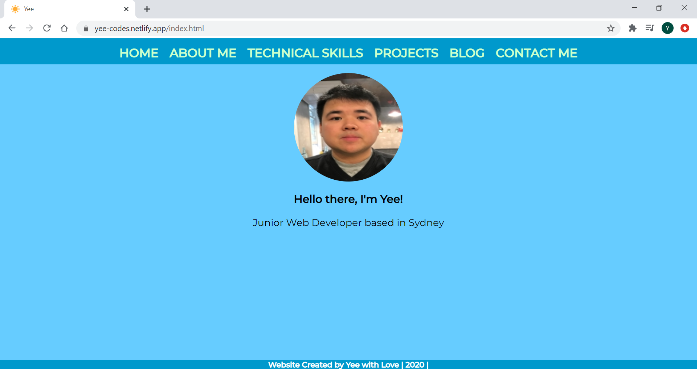
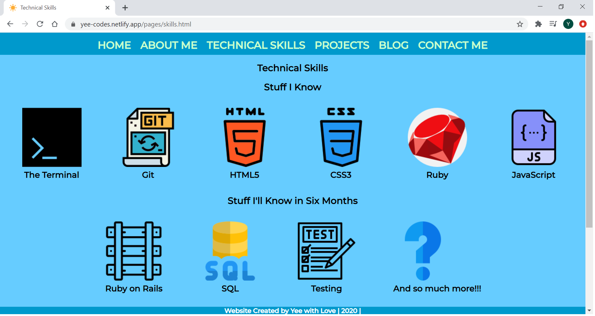

# My Portfolio Website Documentation
## Website URL (Netlify)
Click [here](https://elated-khorana.netlify.app/) to go to the website.

## Link to Portfolio Workspace on Ed
Click [here](https://edstem.org/courses/4464/workspaces/pE2kn7K1HNZh7hvbLpnMbJ5BlwgY02qT) to access the workspace.

## Website Description
### Purpose
The project is created with the aim to provide prospective employers with information about myself. The following information can be found on the website:

* a short bio
* personal interests
* study history
* previous work experience
* my résumé (pdf document)
* technical skills
* previous projects
* blog posts
* contact details
* social media accounts

### Functionality/Features
The homepage consists of a photo of myself and a navigation menu on top of the page to assist web users to navigate to the information they are looking for. The navigation menu has the following links:

* **About Me**: a short bio about myself, my résumé, my study history and previous work experience.
* **Technical Skills**: a list of programming languages/frameworks knowledge I possess, and a link to my GitHub account.
* **Projects**: screenshots and brief descriptions of projects I have previously worked on showcasing my technical skills.
* **Blog**: a page with a list of blog posts I have written with publish date, clicking on the blog title will direct user to the respective blog post.
* **Contact Me**: a page with my contact details and links to my social media accounts.

### Sitemap

## Notes Regarding Sitemap
The sitemap above was created during the design phase of the project, the website developed is slightly different from the layout represented by the sitemap.

Instead of having one HTML file/page for education, work experience, skills, hobbies and résumé, I have decided to combine education, work experience, hobbies and résumé into one page under "About Me". In addition, I thought it would be a better idea for skills to have a standalone page to highlight my technical skills. Hence, I added another item under "Home" named "Technical Skills".

### Screenshots

### Target Audience
As mentioned in the Purpose section, the target audience of this online portfolio is prospective employers.

### Tech Stack Used for Website Development
The programming language used to develop the project is HTML; CSS is used for styling. The finished website is made accessible to the public using Netlify.