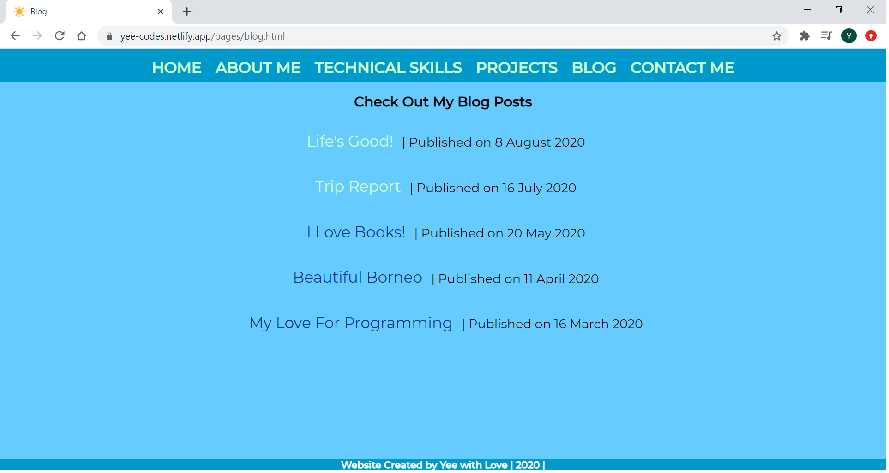
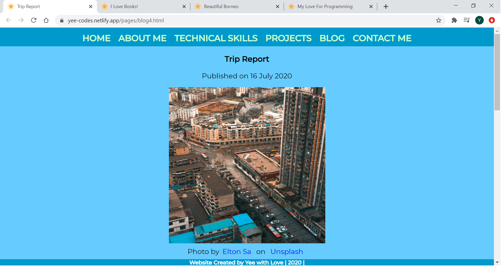

# My Portfolio Website Documentation
## Website URL (Netlify)
Click [here](https://yee-codes.netlify.app/) to go to the website.

## Link to Portfolio Workspace on Ed
Click [here](https://edstem.org/courses/4464/workspaces/pE2kn7K1HNZh7hvbLpnMbJ5BlwgY02qT) to access the workspace.

## Website Description
### Purpose
The project is created with the aim to provide prospective employers with relevant information about myself. The following information can be found on the website:

* a short bio
* personal interests
* study history
* previous work experience
* my résumé (pdf document)
* technical skills
* previous projects
* blog posts
* contact details
* social media accounts

### Functionality/Features
The following is a list of the main components I have used to develop the website. These components were used to ensure that the website is user-friendly, easy to navigate and accessible to all website users (including users with disabilities).

* Navigation bar
* Appropriate use of different headings
* Legible typography
* Images or icons for visual representation
* Hyperlinks to internal pages and external websites
* Responsive design
* Semantic HTML

#### Navigation Bar
This has to be one of the most important, if not the most important component, of the website. It is a list of various links that helps users navigate to different sections of the website for the information they are looking for. The navigation bar is available on top of every page for easy accessibility. I have styled this component differently from the rest of the elements to highlight its importance.

#### Appropriate use of different headings
Different heading tags were used to highlight the page title, section title and blog title. This ensures that the users can easily find the information they are after within a page filled with multiple blocks of text.

#### Legible typography
I have chosen a font type that is legible and professional. Font size was also styled accordingly.

#### Images or icons for visual representation
Where appropriate, I have used images and icons to represent the information that I want to convey. It has been said that a photo speak a thousand words.

#### Hyperlinks to internal pages and external websites
In addition to the classic navigation menu that has links to internal pages, I have also included links that direct users to external websites. For example, I have made the GitHub icon on the "Technical Skills" page a hyperlink, so the users can check out my projects on GitHub.

#### Responsive design
One of the features of a good website is that it will render properly on different screen sizes. I have made sure of this by using the Flexbox model and the use of relative unit such as percentages. Some tools I have used to achieve this objective are Chrome DevTools and the Responsively App.

#### Semantic HTML
I have used semantic HTML tags that give meaning to its content such as, `<header>`, `<footer>`, `<article>`, `<figure>` and `<section>`. This ensures the website is accessible to users with disabilities.

#### A Brief Description of Different Sections of the Website

* **About Me**: a short bio about myself, my résumé, my study history and previous work experience.
* **Technical Skills**: a list of programming languages and frameworks I know and a link to my GitHub account.
* **Projects**: screenshots and brief descriptions of projects I have previously worked on.
* **Blog**: a page with a list of blog posts I have written with publish date, clicking on the blog title will direct user to the respective blog post.
* **Contact Me**: a page with my contact details and links to my social media accounts.

### Sitemap

### Notes Regarding Sitemap
The sitemap above was created in the design phase of the project, the website developed is slightly different from the layout represented by the sitemap.

Instead of having one HTML file/page for education, work experience, skills, hobbies and résumé, I have decided to combine education, work experience, hobbies and résumé into one page under "About Me". In addition, I thought it would be a better idea for skills to have a standalone page to highlight my technical skills. Hence, I added another item under "Home" named "Technical Skills".

### Screenshots

### Target Audience
The target audience of this website is prospective employers.

### Tech Stack Used for Website Development
The tech stack used are HTML and CSS.

The finished website was deployed using Netlify.